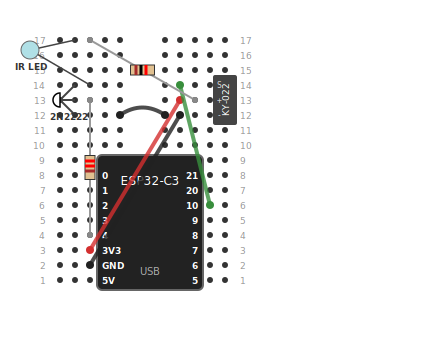

# ESP32-C3 IR Blaster

WiFi-connected IR receiver and transmitter for ESP32-C3. Capture IR codes from remotes, store them on the device, and replay them via a web interface -- no refresh needed for new codes.

## Features

- **Receive:** IR receiver on GPIO 10; last code and raw timing on the web UI and serial. The page updates in real time over WebSocket when you press a remote button.
- **Send:** IR LED on GPIO 4 (via transistor); NEC codes via HTTP or WebSocket, or one-click **Send** on stored codes with large touch-friendly buttons. A modal confirms "Sent: *name*" without leaving the page.
- **Store:** Save codes from the last-received list or enter them manually (name, protocol, value, bits). Stored in NVS across reboots. Rename and delete from the UI.
- **Activity log:** Real-time scrollable log of IR receives and sends. Incoming signals are color-coded: green for known stored commands, amber for likely matches, grey for unknown.
- **Mobile-first UI:** Responsive layout optimized for phones (stored commands first, large buttons) with two-column grid on desktop. Frontend served from **LittleFS** as static HTML/CSS/JS; see [docs/web-interface.md](docs/web-interface.md).

## Web interface preview


## Quick start

1. **Hardware**  
   Wire the board as in [docs/wiring.md](docs/wiring.md). You need an IR receiver (e.g. KY-022/VS1838B), IR LED, 2N2222, and resistors; GPIO 10 = receive, GPIO 4 = send.

   

2. **WiFi**  
   Set your network in `secrets.h` (e.g. `WIFI_SSID`, `WIFI_PASS`).

3. **Build and install** (firmware + frontend)
   ```bash
   pio run --target upload
   pio run --target buildfs
   pio run --target uploadfs
   ```
   Use this full sequence on first install, or any time files in `data/` change.  
   For firmware-only changes, `pio run --target upload` is enough.

   Optional one-liner:
   ```bash
   pio run --target upload && pio run --target buildfs && pio run --target uploadfs
   ```

4. **Serial monitor** (optional)
   ```bash
   pio device monitor
   ```
   See [docs/serial-monitor.md](docs/serial-monitor.md) for logging.

5. **Use**  
   Get the device IP (router DHCP or serial "IP: ..."). Open **`http://<IP>/`** for the full UI. Send NEC directly: `http://<IP>/send?type=nec&data=HEXDATA&length=32`.

## Project layout

- **`src/main.cpp`** -- Firmware: WiFi, LittleFS, AsyncWebServer + WebSocket, IR recv/send, NVS stored codes, template processor.
- **`data/`** -- Frontend files served from LittleFS: `index.html`, `app.css`, `app.js`.
- **`src/ir_utils.cpp`** / **`include/ir_utils.h`** -- Pure helper functions (URL builders, HTML escape) shared by firmware and unit tests.
- **`test/test_ir_utils.cpp`** -- Unity unit tests for the helpers (run on device).
- **`test/integration/test_api.py`** -- pytest integration tests for the HTTP API (run from host).
- **`platformio.ini`** -- PlatformIO envs: `esp32c3-ir` (firmware) and `esp32c3-test` (unit tests).
- **`docs/`** -- Wiring, **web interface & API**, serial monitor, troubleshooting.

## HTTP API (summary)

| Endpoint | Description |
|----------|-------------|
| `GET /` | Main page (HTML from LittleFS with template processor). |
| `WS /ws` | WebSocket for live IR events and send commands. |
| `GET /ip` | Plain text IP. |
| `GET /last` | JSON for "last code" (seq, human, raw, replayUrl); live updates use WebSocket. |
| `GET /send?type=nec&data=HEX&length=32&repeat=1` | Send NEC. |
| `GET /save?name=...` or `...&protocol=&value=&length=` | Save last or specific code. |
| `POST /save` | Save from JSON body. |
| `GET /saved` | JSON array of stored codes. |
| `POST /saved/delete?index=N` | Delete stored code at index N. |
| `POST /saved/rename?index=N&name=NewName` | Rename stored code at index N. |
| `GET /dump` | Plain text dump for hardcoding. |

Full API and UI behavior: **[docs/web-interface.md](docs/web-interface.md)**.

## Requirements

- **PlatformIO** (CLI or Cursor/VS Code extension).
- **Board:** ESP32-C3 (e.g. esp32-c3-devkitm-1 / Super Mini).
- **Libraries:** IRremoteESP8266, ArduinoJson, Preferences (via `lib_deps` / framework).

## Testing

### Unit tests (on device)

Pure helper functions (`replayUrlFor`, `saveUrlFor`, `sendUrlForSaved`, `escapeHtml`) are extracted into `include/ir_utils.h` / `src/ir_utils.cpp` and tested with Unity on the ESP32-C3. The `esp32c3-test` env builds only the helpers (no WiFi, IR, or NVS).

```bash
pio test -e esp32c3-test
```

### Integration tests (HTTP API)

A pytest suite in `test/integration/` hits the real device over the network. Requires the device to be running and reachable.

```bash
pip install -r requirements-test.txt
DEVICE_IP=http://<device-ip> pytest test/integration/
```

Tests cover: `GET /`, `/ip`, `/last`, `/send`, `/saved`, `/dump`, `POST /save` (JSON body), `POST /saved/delete`, query-string save, and 404 handling.

## Documentation

- [Hardware wiring](docs/wiring.md) -- Breadboard, parts, pinout.
- [Web interface & API](docs/web-interface.md) -- Page layout, stored codes, live updates, activity log, full API.
- [Serial monitor](docs/serial-monitor.md) -- Logging and `printf()`.
- [Troubleshooting](docs/troubleshooting.md) -- Common build, upload, serial, WiFi, web UI, and IR issues.
- [Wiring diagram](docs/assets/wiring-breadboard.svg) -- Breadboard visual reference.

For AI assistants and cross-session project context, see [AGENTS.md](AGENTS.md).
