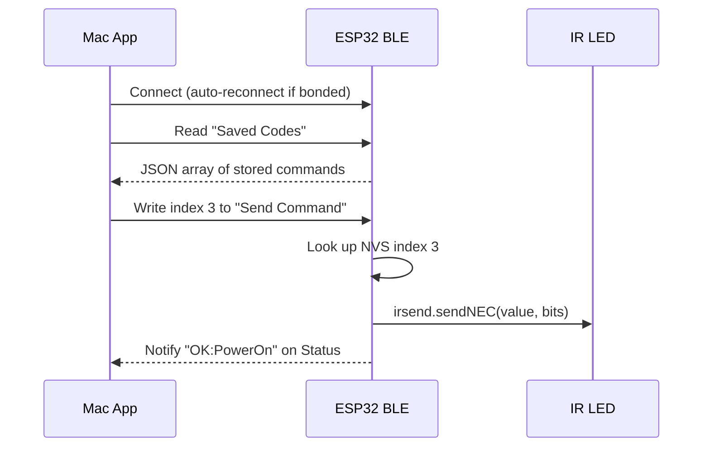

# ESP32-C3 IR Blaster -- Bluetooth Low Energy (BLE)

The IR Blaster exposes a BLE GATT service that lets a paired computer (or phone) send stored IR commands without using the WiFi/HTTP interface. Only **stored commands** can be triggered over BLE; receiving, saving, and managing codes is still done through the [web interface](web-interface.md).

---

## Overview

- **Transport:** Bluetooth Low Energy 5.0 (ESP32-C3 supports BLE only, not Classic Bluetooth).
- **Library:** Built-in Arduino-ESP32 BLE (Bluedroid stack). The `huge_app.csv` partition scheme provides enough flash for BLE + WiFi + IRremote.
- **Security:** Bonding + encryption (LE Secure Connections). By default pairing is **Just Works** (no passkey). You can enable passkey entry in [`include/ble_server.h`](../include/ble_server.h) by setting `BLE_USE_PASSKEY` to `1`.
- **Reconnection:** The ESP32 restarts advertising after any disconnect, so a bonded client reconnects automatically when back in range.

BLE and WiFi run simultaneously -- the HTTP API, WebSocket, and web UI continue to work normally.

---

## Service and characteristics

| Characteristic | UUID | Properties | Payload | Description |
|---|---|---|---|---|
| **IR Control Service** | `e97a0001-c116-4a63-a60f-0e9b4d3648f3` | -- | -- | Service container |
| Saved Codes | `e97a0002-c116-4a63-a60f-0e9b4d3648f3` | Read (encrypted) | JSON array | Full list of stored IR codes, same shape as `GET /saved` |
| Send Command | `e97a0003-c116-4a63-a60f-0e9b4d3648f3` | Write (encrypted) | 1 byte: NVS index | Write the index of a saved code to transmit it |
| Status | `e97a0004-c116-4a63-a60f-0e9b4d3648f3` | Read + Notify (encrypted) | UTF-8 string | Result after a send: `OK:<name>` or `ERR:<reason>` |
| Schedule | `e97a0005-c116-4a63-a60f-0e9b4d3648f3` | Write (encrypted) | JSON (see below) | Arm a delayed command or send a heartbeat to reset the timer |

All characteristics require an **encrypted and authenticated** connection (bonding must be completed before any access).

### Saved Codes payload

A JSON array in **compact form** (short keys to fit the characteristic size limit): each element is `{"i": <index>, "n": "<name>"}`. Example:

```json
[
  { "i": 0, "n": "Power" },
  { "i": 1, "n": "Vol Up" }
]
```

If the list is truncated due to the ~590-byte limit, a **sentinel entry** is appended so clients can detect it and know the full count:

```json
[
  { "i": 0, "n": "Power" },
  { "i": 1, "n": "Vol Up" },
  { "i": -1, "n": "", "_truncated": true, "_total": 12 }
]
```

When building name→index mappings, skip entries where `"i" < 0` or `"_truncated"` is present. Use `"_total"` to know the valid index range (0 to `_total - 1`) and that commands beyond the listed entries exist (e.g. use HTTP `GET /saved` for the full list).

The BLE stack negotiates an MTU up to 512 bytes and supports long reads; only very long lists are truncated.

### Send Command payload

Write a single byte containing the zero-based NVS index of the code to send:

| Byte | Meaning |
|------|---------|
| `0x00` | Send saved code at index 0 |
| `0x01` | Send saved code at index 1 |
| ... | ... |
| `0xFF` | Send saved code at index 255 |

### Status payload

A short UTF-8 string updated after every send attempt:

| Value | Meaning |
|-------|---------|
| `READY` | Initial state after boot, no sends yet |
| `OK:Power` | Successfully sent the code named "Power" |
| `OK:3` | Successfully sent index 3 (unnamed code) |
| `ERR:index 255` | Index out of range |
| `ERR:empty write` | Write contained no data |

Subscribe to notifications on this characteristic to receive the result immediately after writing to Send Command.

### Schedule payload

Write UTF-8 JSON to arm a delayed command or to send a heartbeat:

- **Arm timer:** `{"delay_seconds": 900, "command": "Off"}` — The ESP32 will run the saved code with that **name** (case-insensitive lookup) after `delay_seconds` seconds, unless a heartbeat write resets the timer. Only one scheduled command is active; a new arm replaces the previous one.
- **Heartbeat:** `{"heartbeat": true}` — Resets the timer so the scheduled command does not fire. Clients (e.g. Blaster Mac Client) send this periodically while connected so that when they disconnect, the ESP32 runs the scheduled command (e.g. "Off") after the delay with no further heartbeats.

When the timer expires, the ESP32 looks up the command by name, sends it, and notifies Status (e.g. `OK:scheduled Off`). The schedule is then disarmed.

---

## Sequence diagram



---

## Pairing and bonding

### First-time pairing

1. Power on the ESP32. It begins advertising as **"IR Blaster"**.
2. On your Mac (or phone), scan for BLE devices. You will see "IR Blaster" with the service UUID `e97a0001-…`.
3. Connect. With the default **Just Works** mode (`BLE_USE_PASSKEY` = 0), no passkey is required — pairing completes automatically and the link is encrypted and bonded.
4. If you have enabled passkey mode (`BLE_USE_PASSKEY` = 1 in `include/ble_server.h`), the ESP32 displays a 6-digit passkey on the serial monitor; enter it in the pairing dialog on your Mac/phone.
5. Once paired, the bond keys are stored in NVS on both devices.

### Subsequent connections

After bonding, the client reconnects automatically -- no passkey is needed again. Bond keys persist across reboots on both the ESP32 (NVS) and macOS (system keychain).

### Clearing bonds

To remove all stored bonds and force re-pairing:

- **ESP32:** erase NVS with `esptool.py --port /dev/cu.usbmodem* erase_flash`, then re-flash.
- **Mac:** remove the device from System Settings > Bluetooth.

---

## Auto-reconnect behavior

- **ESP32 side:** The `onDisconnect` callback restarts BLE advertising immediately, so the device is always connectable.
- **macOS side:** CoreBluetooth's `connectPeripheral:options:` queues a reconnection request. When the ESP32 comes back in range and starts advertising, macOS reconnects automatically. The app does not need to scan again.

This means: if you walk away from the ESP32 with your laptop and come back, the connection resumes without user action.

---

## Delayed command and heartbeat (Blaster Mac Client)

The ESP32 does **not** auto-send "On" on connect or "Off" after a fixed disconnect timeout. Instead, a client can:

1. **On connect:** Send "On" by writing the appropriate saved-code index to Send Command (the client resolves names to indices via the Saved Codes characteristic).
2. **Arm a delayed command:** Write to Schedule: `{"delay_seconds": 900, "command": "Off"}`. The ESP32 will run that command by name after 900 seconds unless the timer is reset by a heartbeat.
3. **Send heartbeats:** While connected, the client writes `{"heartbeat": true}` to Schedule periodically (e.g. every 60 seconds). Each write resets the timer.
4. **On disconnect:** When the client disconnects, heartbeats stop. After `delay_seconds` with no heartbeat, the ESP32 runs the scheduled command (e.g. "Off") once.

All command names and delays are configured on the client; the ESP32 only provides a generic "run command by name after T seconds, reset T on heartbeat" mechanism. See [Schedule payload](#schedule-payload) above for the JSON format.

---

## Testing with nRF Connect

Before building a dedicated app, you can verify BLE operation using the free **nRF Connect** app (available for macOS, iOS, and Android):

1. Open nRF Connect and scan for devices. Find **"IR Blaster"**.
2. Tap **Connect**. With default firmware no passkey is needed; if you enabled `BLE_USE_PASSKEY`, enter the passkey shown on Serial.
3. Expand the service `e97a0001-…`. You will see four characteristics.
4. **Read** `e97a0002-…` (Saved Codes) — you should see the JSON array of your stored commands.
5. **Subscribe** to notifications on `e97a0004-…` (Status).
6. **Write** a single byte (e.g., `0x00`) to `e97a0003-…` (Send Command).
7. Check that the Status notification shows `OK:<name>` and the IR LED fires.
8. **Write** to `e97a0005-…` (Schedule) to arm a delayed command (e.g. `{"delay_seconds": 900, "command": "Off"}`) or send a heartbeat (`{"heartbeat": true}`).

---

## Running integration tests

The BLE integration tests use [bleak](https://bleak.readthedocs.io/) (Python async BLE library) and follow the same pattern as the HTTP tests in `test/integration/test_api.py`.

### Setup

```bash
pip install -r requirements-test.txt
```

### Run

```bash
# By device name (default: "IR Blaster")
DEVICE_BLE_NAME="IR Blaster" pytest test/integration/test_ble.py -v

# By device address
DEVICE_BLE_ADDR="AA:BB:CC:DD:EE:FF" pytest test/integration/test_ble.py -v
```

The device must be powered on, advertising, and already bonded with the Mac running the tests. Tests cover:

- **Discovery** — device found, service UUID advertised.
- **Saved Codes** — read returns valid JSON array with expected keys.
- **Send Command** — write index 0 and verify `OK:` status notification.
- **Invalid Index** — write index 255 and verify `ERR:` status notification.
- **Schedule** — write arm (`{"delay_seconds", "command"}`) and heartbeat (`{"heartbeat": true}`); writes succeed.
- **Status Read** — characteristic is non-empty.

---

## Implementation files

| File | Purpose |
|------|---------|
| [`include/ble_server.h`](../include/ble_server.h) | UUIDs, device name, `BLE_USE_PASSKEY` / passkey, public API (`setupBLE`, `loopBLE`) |
| [`src/ble_server.cpp`](../src/ble_server.cpp) | Bluedroid GATT server: service, characteristics, security, callbacks, Schedule (delayed command + heartbeat) |
| [`src/main.cpp`](../src/main.cpp) | `sendSavedCode()` and `getSavedCodesJson()` shared helpers; `setupBLE()` called from `setup()` |
| [`test/integration/test_ble.py`](../test/integration/test_ble.py) | pytest + bleak integration tests |

---

## Flash budget note


The Bluedroid BLE stack is larger than NimBLE, so the firmware uses the `huge_app.csv` partition scheme (~3 MB app partition, ~960 KB filesystem). This eliminates OTA support but provides ample room for BLE + WiFi + IRremote. The LittleFS partition (960 KB) is more than sufficient for the frontend files.
