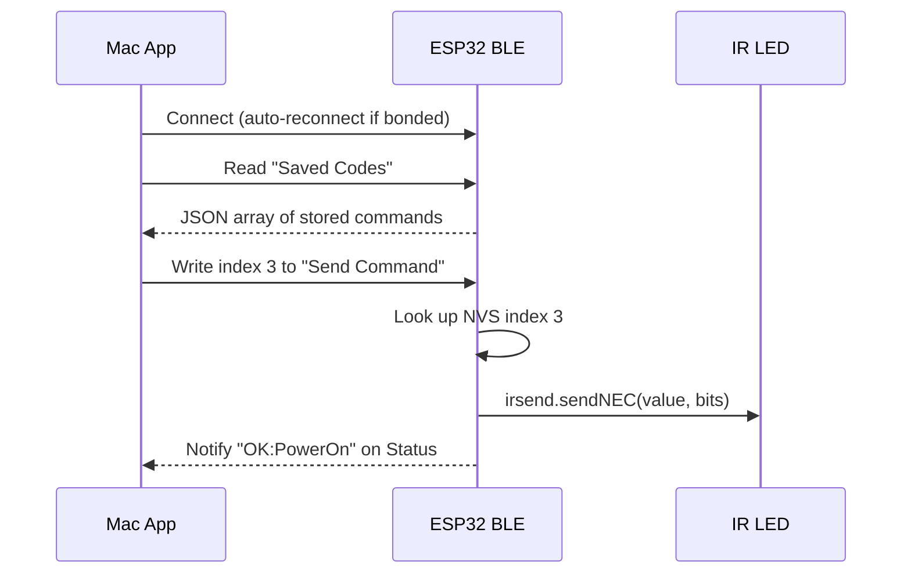

# ESP32-C3 IR Blaster -- Bluetooth Low Energy (BLE)

The IR Blaster exposes a BLE GATT service that lets a paired computer (or phone) send stored IR commands without using the WiFi/HTTP interface. Only **stored commands** can be triggered over BLE; receiving, saving, and managing codes is still done through the [web interface](web-interface.md).

---

## Overview

- **Transport:** Bluetooth Low Energy 5.0 (ESP32-C3 supports BLE only, not Classic Bluetooth).
- **Library:** Built-in Arduino-ESP32 BLE (Bluedroid stack). The `huge_app.csv` partition scheme provides enough flash for BLE + WiFi + IRremote.
- **Security:** Bonding + MITM protection + LE Secure Connections. A 6-digit passkey is displayed on Serial during first pairing.
- **Reconnection:** The ESP32 restarts advertising after any disconnect, so a bonded client reconnects automatically when back in range.

BLE and WiFi run simultaneously -- the HTTP API, WebSocket, and web UI continue to work normally.

---

## Service and characteristics

| Characteristic | UUID | Properties | Payload | Description |
|---|---|---|---|---|
| **IR Control Service** | `e97a0001-c116-4a63-a60f-0e9b4d3648f3` | -- | -- | Service container |
| Saved Codes | `e97a0002-c116-4a63-a60f-0e9b4d3648f3` | Read (encrypted) | JSON array | Full list of stored IR codes, same shape as `GET /saved` |
| Send Command | `e97a0003-c116-4a63-a60f-0e9b4d3648f3` | Write (encrypted) | 1 byte: NVS index | Write the index of a saved code to transmit it |
| Status | `e97a0004-c116-4a63-a60f-0e9b4d3648f3` | Read + Notify (encrypted) | UTF-8 string | Result after a send: `OK:<name>` or `ERR:<reason>` |

All characteristics require an **encrypted and authenticated** connection (bonding must be completed before any access).

### Saved Codes payload

A JSON array identical to the HTTP `GET /saved` response:

```json
[
  { "index": 0, "name": "Power", "protocol": "NEC", "value": "FF827D00", "bits": 32 },
  { "index": 1, "name": "Vol Up", "protocol": "NEC", "value": "FF629D00", "bits": 32 }
]
```

The BLE stack negotiates an MTU up to 512 bytes and supports long reads, so lists of dozens of codes transfer without issue.

### Send Command payload

Write a single byte containing the zero-based NVS index of the code to send:

| Byte | Meaning |
|------|---------|
| `0x00` | Send saved code at index 0 |
| `0x01` | Send saved code at index 1 |
| ... | ... |
| `0xFF` | Send saved code at index 255 |

### Status payload

A short UTF-8 string updated after every send attempt:

| Value | Meaning |
|-------|---------|
| `READY` | Initial state after boot, no sends yet |
| `OK:Power` | Successfully sent the code named "Power" |
| `OK:3` | Successfully sent index 3 (unnamed code) |
| `ERR:index 255` | Index out of range |
| `ERR:empty write` | Write contained no data |

Subscribe to notifications on this characteristic to receive the result immediately after writing to Send Command.

---

## Sequence diagram



---

## Pairing and bonding

### First-time pairing

1. Power on the ESP32. It begins advertising as **"IR Blaster"**.
2. On your Mac (or phone), scan for BLE devices. You will see "IR Blaster" with the service UUID `e97a0001-…`.
3. Connect. The ESP32 initiates pairing with a **6-digit passkey** displayed on the serial monitor:
   ```
   [BLE] *** Pairing passkey: 123456 — enter this on the client ***
   ```
4. Enter the passkey in the system pairing dialog on your Mac/phone.
5. Once paired, the bond keys are stored in NVS on both devices.

The default passkey is `123456`. To change it, edit `BLE_PASSKEY` in [`include/ble_server.h`](../include/ble_server.h).

### Subsequent connections

After bonding, the client reconnects automatically -- no passkey is needed again. Bond keys persist across reboots on both the ESP32 (NVS) and macOS (system keychain).

### Clearing bonds

To remove all stored bonds and force re-pairing:

- **ESP32:** erase NVS with `esptool.py --port /dev/cu.usbmodem* erase_flash`, then re-flash.
- **Mac:** remove the device from System Settings > Bluetooth.

---

## Auto-reconnect behavior

- **ESP32 side:** The `onDisconnect` callback restarts BLE advertising immediately, so the device is always connectable.
- **macOS side:** CoreBluetooth's `connectPeripheral:options:` queues a reconnection request. When the ESP32 comes back in range and starts advertising, macOS reconnects automatically. The app does not need to scan again.

This means: if you walk away from the ESP32 with your laptop and come back, the connection resumes without user action.

---

## Auto-send on connect and disconnect timeout

For clients like **Blaster Mac Client** that control a dome light or indicator:

- **On connect:** When a BLE client connects (after bonding), the ESP32 automatically sends the saved code at index **5** ("On"). The Status characteristic is updated and notified so the client sees the result.
- **After 15 minutes disconnected:** If no BLE client has reconnected for 15 minutes, the ESP32 sends the saved code at index **0** ("Off") once. This runs in `loopBLE()` and does not require a connected client.

Indices and timeout are defined in [`include/ble_server.h`](../include/ble_server.h): `BLE_CONNECT_SEND_INDEX`, `BLE_TIMEOUT_SEND_INDEX`, and `BLE_DISCONNECT_TIMEOUT_MS`. The "Off" timeout only runs after at least one client has connected since boot; it does not fire on fresh power-up.

---

## Testing with nRF Connect

Before building a dedicated app, you can verify BLE operation using the free **nRF Connect** app (available for macOS, iOS, and Android):

1. Open nRF Connect and scan for devices. Find **"IR Blaster"**.
2. Tap **Connect**. Accept the pairing dialog and enter the passkey (`123456`).
3. Expand the service `e97a0001-…`. You will see three characteristics.
4. **Read** `e97a0002-…` (Saved Codes) -- you should see the JSON array of your stored commands.
5. **Subscribe** to notifications on `e97a0004-…` (Status).
6. **Write** a single byte (e.g., `0x00`) to `e97a0003-…` (Send Command).
7. Check that the Status notification shows `OK:<name>` and the IR LED fires.

---

## Running integration tests

The BLE integration tests use [bleak](https://bleak.readthedocs.io/) (Python async BLE library) and follow the same pattern as the HTTP tests in `test/integration/test_api.py`.

### Setup

```bash
pip install -r requirements-test.txt
```

### Run

```bash
# By device name (default: "IR Blaster")
DEVICE_BLE_NAME="IR Blaster" pytest test/integration/test_ble.py -v

# By device address
DEVICE_BLE_ADDR="AA:BB:CC:DD:EE:FF" pytest test/integration/test_ble.py -v
```

The device must be powered on, advertising, and already bonded with the Mac running the tests. Tests cover:

- **Discovery** -- device found, service UUID advertised.
- **Saved Codes** -- read returns valid JSON array with expected keys.
- **Send Command** -- write index 0 and verify `OK:` status notification.
- **Invalid Index** -- write index 255 and verify `ERR:` status notification.
- **Status Read** -- characteristic is non-empty.

---

## Implementation files

| File | Purpose |
|------|---------|
| [`include/ble_server.h`](../include/ble_server.h) | UUIDs, device name, passkey, public API (`setupBLE`, `loopBLE`) |
| [`src/ble_server.cpp`](../src/ble_server.cpp) | Bluedroid GATT server: service, characteristics, security, callbacks, auto-send on connect/timeout |
| [`src/main.cpp`](../src/main.cpp) | `sendSavedCode()` and `getSavedCodesJson()` shared helpers; `setupBLE()` called from `setup()` |
| [`test/integration/test_ble.py`](../test/integration/test_ble.py) | pytest + bleak integration tests |

---

## Flash budget note

The Bluedroid BLE stack is larger than NimBLE, so the firmware uses the `huge_app.csv` partition scheme (~3 MB app partition, ~960 KB filesystem). This eliminates OTA support but provides ample room for BLE + WiFi + IRremote. The LittleFS partition (960 KB) is more than sufficient for the frontend files.
