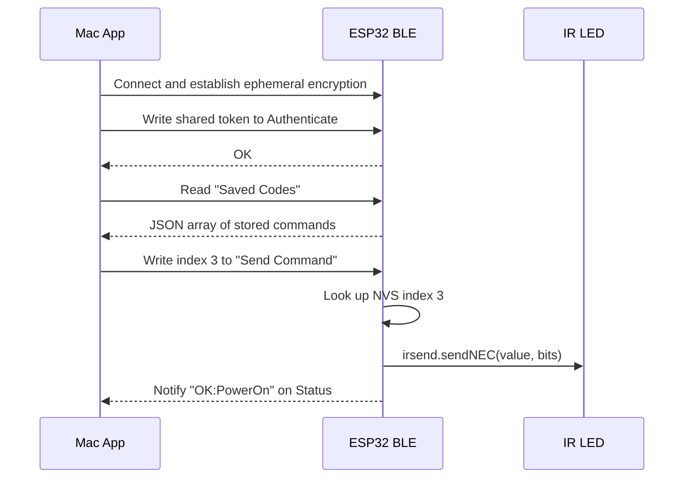

# ESP32-C3 IR Blaster -- Bluetooth Low Energy (BLE)

The IR Blaster exposes a BLE GATT service that lets an authorized computer (or phone) send stored IR commands without using the WiFi/HTTP interface. Only **stored commands** can be triggered over BLE; receiving, saving, and managing codes is still done through the [web interface](web-interface.md).

---

## Overview

- **Transport:** Bluetooth Low Energy 5.0 (ESP32-C3 supports BLE only, not Classic Bluetooth).
- **Library:** Built-in Arduino-ESP32 BLE (Bluedroid stack). The `huge_app.csv` partition scheme provides enough flash for BLE + WiFi + IRremote.
- **Security:** Non-bonded LE Secure Connections plus a 16–64 character application token. Avoiding persistent SMP keys prevents stale Mac/ESP32 bonds from blocking reconnects.
- **Reconnection:** The ESP32 restarts advertising after any disconnect. Each connection is encrypted and authorized again, with no stored bond to become inconsistent.

BLE and WiFi run simultaneously -- the HTTP API, WebSocket, and web UI continue to work normally.

---

## Service and characteristics

| Characteristic | UUID | Properties | Payload | Description |
|---|---|---|---|---|
| **IR Control Service** | `e97a0001-c116-4a63-a60f-0e9b4d3648f3` | -- | -- | Service container |
| Authenticate | `e97a0006-c116-4a63-a60f-0e9b4d3648f3` | Read + Write (encrypted) | UTF-8 token / `OK` | Authorize this connection before using other characteristics |
| Saved Codes | `e97a0002-c116-4a63-a60f-0e9b4d3648f3` | Read (encrypted) | JSON array | Full list of stored IR codes, same shape as `GET /saved` |
| Send Command | `e97a0003-c116-4a63-a60f-0e9b4d3648f3` | Write (encrypted) | 1 byte: NVS index | Write the index of a saved code to transmit it |
| Status | `e97a0004-c116-4a63-a60f-0e9b4d3648f3` | Read + Notify (encrypted) | UTF-8 string | Notifies the result after a send: `OK:<name>` or `ERR:<reason>`. On connect its value is the reconnect countdown snapshot (JSON, see below) |
| Schedule | `e97a0005-c116-4a63-a60f-0e9b4d3648f3` | Write (encrypted) | JSON (see below) | Configure the disconnect-delayed command, or send a keepalive |

All characteristics require encryption. After connecting, write `BLE_AUTH_TOKEN` to Authenticate and read back `OK`. Every other operation is rejected until that succeeds.

### Saved Codes payload

A JSON array in **compact form** (short keys to fit the characteristic size limit): each element is `{"i": <index>, "n": "<name>"}`. Example:

```json
[
  { "i": 0, "n": "Power" },
  { "i": 1, "n": "Vol Up" }
]
```

If the list is truncated due to the ~590-byte limit, a **sentinel entry** is appended so clients can detect it and know the full count:

```json
[
  { "i": 0, "n": "Power" },
  { "i": 1, "n": "Vol Up" },
  { "i": -1, "n": "", "_truncated": true, "_total": 12 }
]
```

When building name→index mappings, skip entries where `"i" < 0` or `"_truncated"` is present. Use `"_total"` to know the valid index range (0 to `_total - 1`) and that commands beyond the listed entries exist (e.g. use HTTP `GET /saved` for the full list).

The BLE stack negotiates an MTU up to 512 bytes and supports long reads; only very long lists are truncated.

### Send Command payload

Write a single byte containing the zero-based NVS index of the code to send:

| Byte | Meaning |
|------|---------|
| `0x00` | Send saved code at index 0 |
| `0x01` | Send saved code at index 1 |
| ... | ... |
| `0xFF` | Send saved code at index 255 |

### Status payload

A short UTF-8 string updated after every send attempt:

| Value | Meaning |
|-------|---------|
| `READY` | Initial state after boot, no sends yet |
| `OK:Power` | Successfully sent the code named "Power" |
| `OK:3` | Successfully sent index 3 (unnamed code) |
| `ERR:index 255` | Index out of range |
| `ERR:empty write` | Write contained no data |

Subscribe to notifications on this characteristic to receive the result immediately after writing to Send Command.

### Reconnect countdown snapshot

On every connect the ESP32 records what happened to the disconnect countdown and
parks it in **Status** as JSON, before cancelling the live timer:

- `{"state":"interrupted","remaining_seconds":742,"command":"Off"}` — this
  connection arrived before the deadline and canceled the countdown.
- `{"state":"expired","remaining_seconds":0,"command":"Off"}` — the deadline
  elapsed before this connection.
- `{"state":"none","remaining_seconds":0,"command":""}` — no disconnect
  countdown preceded this connection.

It is the source of truth for clients deciding whether a reconnect should replay
startup commands. **Read it before the first send of the connection:** Status
also carries command results, so a send replaces the snapshot with `OK:<name>`.

The snapshot rides on Status for protocol compatibility and must be read before
the first command result overwrites it.

### Schedule payload

Write UTF-8 JSON to configure the disconnect-delayed command or send a keepalive:

- **Configure:** `{"delay_seconds": 900, "command": "Off"}` — Stores the saved-code **name** (case-insensitive lookup) and delay. The countdown does **not** start while connected. A new configure replaces the previous one and cancels any active countdown.
- **Heartbeat:** `{"heartbeat": true}` — Keepalive while connected. Resets the half-open link watchdog (see below) so a healthy but idle connection is not dropped. It does not arm or start a countdown.

When the BLE client disconnects, the ESP32 starts the countdown. If the client reconnects before the delay elapses, the countdown is cancelled. If the delay expires while disconnected, the ESP32 looks up the command by name, sends it, and notifies Status (e.g. `OK:scheduled Off`). The countdown stops (configuration remains until replaced).

### Half-open link watchdog

If the BLE stack still reports a client connected but no GATT read or write arrives for `BLE_LINK_IDLE_TIMEOUT_MS` (default **180 seconds**), the ESP32 treats the link as dead: it force-disconnects, restarts advertising, and starts the disconnect countdown if a command is configured.

This recovers from half-open links, where the client is gone (sleeping laptop, out-of-range walk-off) but the ESP32 never received a disconnect event — previously the device would sit "connected" forever, unreachable and with no countdown running.

Two races make this watchdog easy to get wrong, and both present as a client that connects and is dropped again a second or two later:

- **Reading the clock before the activity stamp.** GATT callbacks update the stamp from the Bluetooth task. If the stamp is read after `millis()`, a callback landing between the two reads leaves it ahead of "now", and the unsigned subtraction wraps to ~49 days — instantly exceeding any timeout. The stamp must be sampled first.
- **Tearing down "the current connection".** A client can reconnect between the idle check and the teardown, so the drop is keyed to the connection that was judged idle, by connection id plus a counter bumped on every connect.

Because any read or write counts as activity, clients should write a Schedule heartbeat every ~60 seconds so a healthy idle connection is not dropped. Override the timeout by defining `BLE_LINK_IDLE_TIMEOUT_MS` at build time.

---

## Sequence diagram


```mermaid
sequenceDiagram
    participant Mac as Mac App
    participant BLE as ESP32 BLE
    participant IR as IR LED

    Mac->>BLE: Connect and establish ephemeral encryption
    Mac->>BLE: Write shared token to Authenticate
    BLE-->>Mac: OK
    Mac->>BLE: Read "Saved Codes"
    BLE-->>Mac: JSON array of stored commands

    Mac->>BLE: Write index 3 to "Send Command"
    BLE->>BLE: Look up NVS index 3
    BLE->>IR: irsend.sendNEC(value, bits)
    BLE-->>Mac: Notify "OK:PowerOn" on Status
```

---

## Encryption and authorization

Set `BLE_AUTH_TOKEN` in firmware `.env` to a random 16–64 character value
(`openssl rand -hex 24` is suitable). Clients must use the same value. On this
Mac, `make sync-mac-client` copies `BLE_DEVICE_NAME` and `BLE_AUTH_TOKEN` from
`.env` into the running Blaster Mac Client (or its installed `config.yaml`).

The default Just Works exchange creates encrypted session keys but does not bond,
so keys are discarded at disconnect. `BLE_USE_PASSKEY=1` adds MITM protection
but requires passkey entry on every connection.

When migrating from older bonded firmware, forget the device once in **System
Settings → Bluetooth** before connecting to the new firmware. No further bond
maintenance is needed.

---

## Auto-reconnect behavior

- **ESP32 side:** The `onDisconnect` callback — and the [half-open link watchdog](#half-open-link-watchdog) — restart BLE advertising immediately, so the device is always connectable after either a real or a half-open link loss.
- **macOS side:** The client retains the discovered CoreBluetooth peripheral and reconnects directly. It only scans again after repeated failures.

This means: if you walk away from the ESP32 with your laptop and come back, the connection resumes without user action.

---

## Delayed command on disconnect (Blaster Mac Client)

The ESP32 does **not** auto-send "On" on connect. Instead, a client can:

1. **On connect:** Send "On" by writing the appropriate saved-code index to Send Command (the client resolves names to indices via the Saved Codes characteristic).
2. **Configure a disconnect command:** Write to Schedule: `{"delay_seconds": 900, "command": "Off"}`. This only stores the command and delay; the countdown does not run while connected.
3. **Send heartbeats:** While connected, write `{"heartbeat": true}` to Schedule periodically (e.g. every 60 seconds) so the idle watchdog does not force-drop a healthy link.
4. **On disconnect (or an idle-timeout force-drop):** The ESP32 starts the countdown. After `delay_seconds` without a reconnect, it runs the scheduled command (e.g. "Off") once.
5. **On reconnect:** The countdown is cancelled; the client reads the [reconnect countdown snapshot](#reconnect-countdown-snapshot) from Status to decide whether to replay its on-connect commands, then re-configures Schedule.

All command names and delays are configured on the client; the ESP32 provides "run command by name T seconds after disconnect." See [Schedule payload](#schedule-payload) above for the JSON format.

---

## Testing with nRF Connect

Before building a dedicated app, you can verify BLE operation using the free **nRF Connect** app (available for macOS, iOS, and Android):

1. Open nRF Connect and scan for the `BLE_DEVICE_NAME` configured in `.env`.
2. Tap **Connect**. With default firmware no passkey is needed; if you enabled `BLE_USE_PASSKEY`, enter the passkey shown on Serial.
3. Expand the service `e97a0001-…`. You will see four characteristics.
4. **Read** `e97a0002-…` (Saved Codes) — you should see the JSON array of your stored commands.
5. **Subscribe** to notifications on `e97a0004-…` (Status).
6. **Write** a single byte (e.g., `0x00`) to `e97a0003-…` (Send Command).
7. Check that the Status notification shows `OK:<name>` and the IR LED fires.
8. **Write** to `e97a0005-…` (Schedule) to configure a disconnect-delayed command (e.g. `{"delay_seconds": 900, "command": "Off"}`), or `{"heartbeat": true}` to send a keepalive.

---

## Running integration tests

The BLE integration tests use [bleak](https://bleak.readthedocs.io/) (Python async BLE library) and follow the same pattern as the HTTP tests in `test/integration/test_api.py`.

### Setup

```bash
pip install -r requirements-test.txt
```

### Run

```bash
# By device name (default: "IR Blaster")
DEVICE_BLE_NAME="IR Blaster" DEVICE_BLE_AUTH_TOKEN="<token>" \
  pytest test/integration/test_ble.py -v

# By device address
DEVICE_BLE_ADDR="AA:BB:CC:DD:EE:FF" DEVICE_BLE_AUTH_TOKEN="<token>" \
  pytest test/integration/test_ble.py -v
```

The device must be powered on, advertising, and configured with the supplied token. Tests cover:

- **Discovery** — device found, service UUID advertised.
- **Saved Codes** — read returns valid JSON array with expected keys.
- **Send Command** — write index 0 and verify `OK:` status notification.
- **Invalid Index** — write index 255 and verify `ERR:` status notification.
- **Schedule** — write configure (`{"delay_seconds", "command"}`) and heartbeat.
- **Status Read** — characteristic is non-empty and holds the reconnect snapshot on connect.

---

## Implementation files

| File | Purpose |
|------|---------|
| [`include/ble_server.h`](../include/ble_server.h) | UUIDs, device name, idle timeout, public API (`setupBLE`, `loopBLE`) |
| [`src/ble_server.cpp`](../src/ble_server.cpp) | Bluedroid GATT server: service, characteristics, security, callbacks, Schedule (disconnect-delayed command), half-open link watchdog |
| [`src/main.cpp`](../src/main.cpp) | `sendSavedCode()` and `getSavedCodesJson()` shared helpers; `setupBLE()` called from `setup()` |
| [`test/integration/test_ble.py`](../test/integration/test_ble.py) | pytest + bleak integration tests |

---

## Flash budget note


The Bluedroid BLE stack is larger than NimBLE, so the firmware uses the `huge_app.csv` partition scheme (~3 MB app partition, ~960 KB filesystem). This eliminates OTA support but provides ample room for BLE + WiFi + IRremote. The LittleFS partition (960 KB) is more than sufficient for the frontend files.
