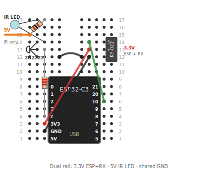

# ESP32-C3 IR Blaster – Hardware Wiring

This guide explains how to wire the IR receiver and IR transmitter on a breadboard. The firmware uses **GPIO 10** for receive and **GPIO 4** for send.

## Power rails (dual supply)

Use two rails with a **shared ground**:

| Rail | Powers | Do not connect to |
|------|--------|-------------------|
| **3.3 V** | ESP32-C3 (`3V3` pin) and KY-022 receiver | IR LED anode |
| **5 V** | IR LED anode (via series resistor) | ESP `3V3`, KY-022 VCC, or any GPIO |

GPIO 4 only drives the transistor base (3.3 V logic). The transistor switches the higher-current **5 V** LED path, so the ESP never sources the LED current.

**Common GND is required** between the 3.3 V rail, 5 V rail, and ESP GND so the transistor can switch the LED.

---

## Visual Diagram

The diagram below shows the **breadboard view** with **Row 1 at the bottom** and the **USB port facing down**.

*   **Orientation:** Row 1 at bottom, Row 17 at top.
*   **ESP32:** Sits in Rows 1–8.
*   **Pinout:**
    *   **Left Side (bottom to top):** 5V, GND, 3V3, 4, 3, 2, 1, 0.
    *   **Right Side (bottom to top):** 5, 6, 7, 8, 9, 10, 20, 21.

---

## Parts List

| Part | Role |
|------|------|
| **ESP32-C3** | Board running the firmware (powered from **3.3 V**). |
| **KY-022** | IR **receiver** on **3.3 V**. Connect OUT to **GPIO 10**. |
| **IR LED** | IR **emitter**. Anode on **5 V** via resistor; cathode switched by the transistor. |
| **2N2222 NPN** | **Transistor**. Switches the LED to ground. |
| **Resistors** | **220 Ω** (base); **100 Ω** (LED series, ~35 mA at 5 V). |
| **Breadboard** | 17-row (or larger) breadboard. |

For more range, try **68 Ω** (~50 mA) or **47 Ω** (~75 mA). Stay within your IR LED’s pulsed rating and keep the 2N2222 well within limits.

---

## Exact Hole-by-Hole Wiring

Use this checklist to verify every connection.

### 1. Board Placement
*   Place the **ESP32-C3** at the bottom of the breadboard (Rows 1–8), straddling the center gutter.
*   **USB port** should be at the bottom (Row 1).
*   **Offset:** Position the board so there are **3 empty holes** to its left and **2 empty holes** to its right.

### 2. Power into the breadboard
*   **3.3 V rail:** Feed into **Left Pin 3** (`3V3`) on the ESP (powers the board). The existing **3V3 Wire** below shares that rail with the receiver.
*   **5 V rail:** Feed into **Row 15 Left** (LED supply only). Do **not** tie this into the ESP `3V3` or KY-022 VCC.
*   **GND:** Tie both supply grounds to **Left Pin 2** (`GND`) / **Row 12** (see below).

### 3. ESP32 Connections
*   **GND Wire:** Connect **Left Pin 2** (GND) to **Row 12 Right**.
*   **3V3 Wire:** Connect **Left Pin 3** (3V3) to **Row 13 Right**.
*   **GPIO 4 (Base):** Connect **Left Pin 4** (GPIO 4) to **Row 13 Left** using a **220 Ω resistor**.
*   **GPIO 10 (Signal):** Connect **Right Pin 6** (GPIO 10) to **Row 14 Right** using a **Green wire**.

### 4. Ground Bus
*   **Jumper:** Connect **Row 12 Left** (L5) to **Row 12 Right** (R1) to link the ground on both sides.

### 5. KY-022 Receiver (Right Side)
Place the module on the **Right** side in rows 12–14:
*   **(-) GND:** Leg goes into **Row 12 Right**.
*   **(+) VCC:** Leg goes into **Row 13 Right** (**3.3 V only**).
*   **(S) Signal:** Leg goes into **Row 14 Right**.

### 6. 2N2222 Transistor (Left Side)
Place the transistor on the **Left** side with the **flat edge facing right** (legs in L2):
*   **Emitter (E):** Top leg goes into **Row 12 Left**.
*   **Base (B):** Middle leg goes into **Row 13 Left**.
*   **Collector (C):** Bottom leg goes into **Row 14 Left**.

### 7. IR LED (Left Side)
Place the LED on the **Left** side (far left, L1 column):
*   **Cathode (Short leg/-):** Connects to **Row 14 Left** (joining the Transistor Collector).
*   **Anode (Long leg/+):** Connects to **Row 17 Left**.

### 8. LED Power (5 V)
*   **5 V feed:** External **5 V** into **Row 15 Left**.
*   **Resistor (100 Ω):** Bridge from **Row 15 Left** (5 V) to **Row 17 Left** (LED Anode).

---

## Summary of Rows

| Row | Left Side (L) | Right Side (R) |
|-----|---------------|----------------|
| **12** | Transistor Emitter, GND Jumper | **GND Wire**, KY-022 (-), GND Jumper |
| **13** | Transistor Base, **220Ω from Pin 4** | **3V3 Wire**, KY-022 (+) |
| **14** | Transistor Collector, LED Cathode (-) | **GPIO 10 Wire**, KY-022 (S) |
| **15** | **5 V rail**, 100Ω start | *(Empty)* |
| **17** | LED Anode (+), 100Ω end | *(Empty)* |

**Do not** put 5 V on the ESP `3V3` pin, the KY-022 VCC, or GPIO. Keep the receiver on **3.3 V** so its signal stays safe for the ESP32-C3.
